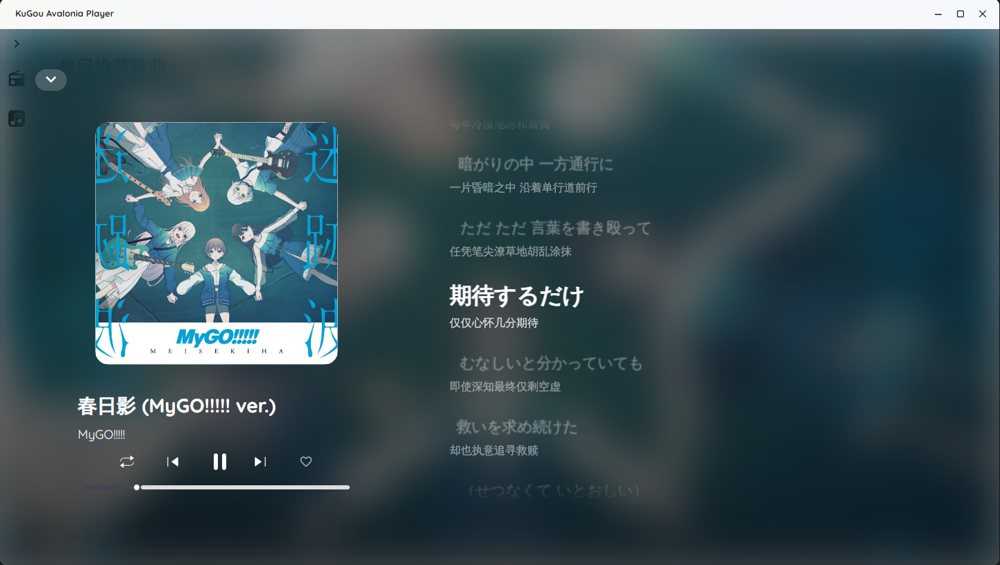
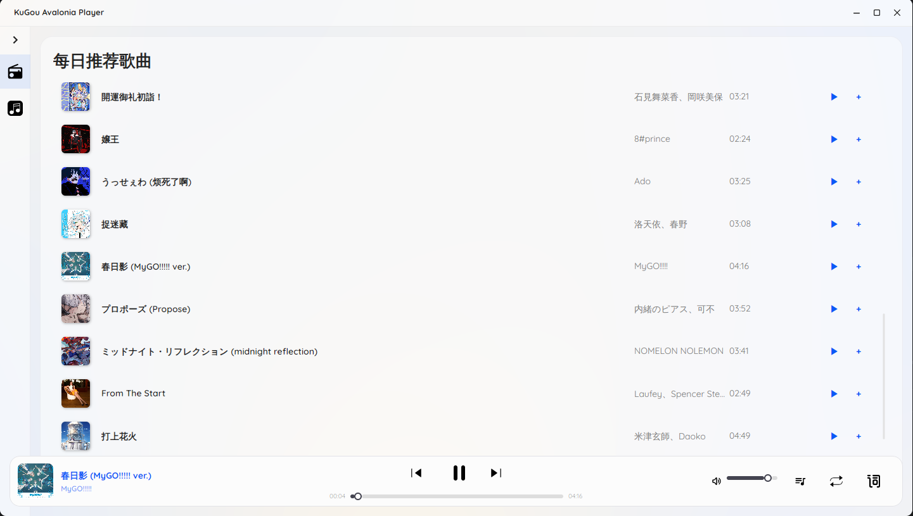

# KugouMusicApi.NET

基于 .NET 10.0 开发的跨平台桌面音乐播放器，集成酷狗音乐 API

## 项目结构

```
KugouMusicApi.NET/
├── KuGou.Net/           # 酷狗 API 核心库
├── SimpleAudio/         # 音频播放组件
├── KugouAvaloniaPlayer/           # 桌面客户端
├── KgWebApi.Net/        # Web API 服务
└── ConsoleApp1/         # 控制台测试程序
```

## 截图





## 快速开始

### 安装

- 访问本项目的 [Releases](https://github.com/Linsxyx/KugouMusic.NET/releases) 页面下载安装包。

### 环境要求

- .NET 10.0 SDK
- Windows/Linux/macOS

### 构建运行

```bash
# 克隆项目
git clone
https://github.com/Linsxyx/KugouMusic.NET.git
cd KugouMusicApi.NET

# 构建项目
dotnet build KugouMusic.NET.slnx

# 运行桌面客户端
dotnet run --project KugouAvaloniaPlayer/KugouAvaloniaPlayer.csproj

# 运行 Web API
dotnet run --project KgWebApi.Net/KgWebApi.Net.csproj
```

##  开源许可

本项目仅供个人学习研究使用，禁止用于商业及非法用途。

[The MIT License (MIT)](https://github.com/Linsxyx/KugouMusic.NET/blob/master/LICENSE) 

