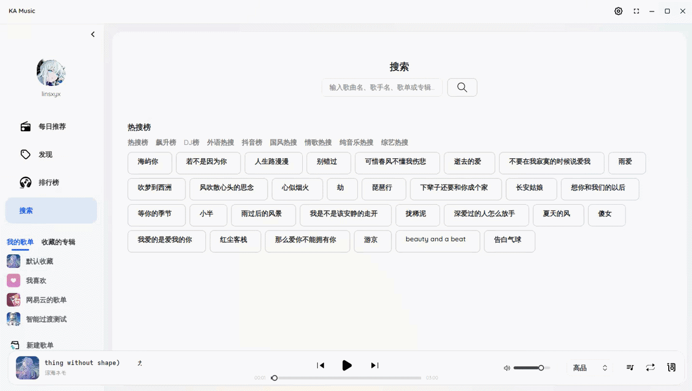
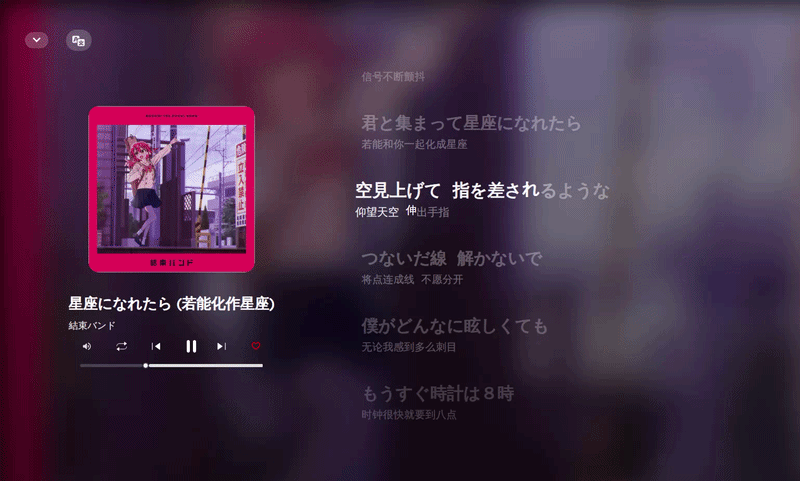
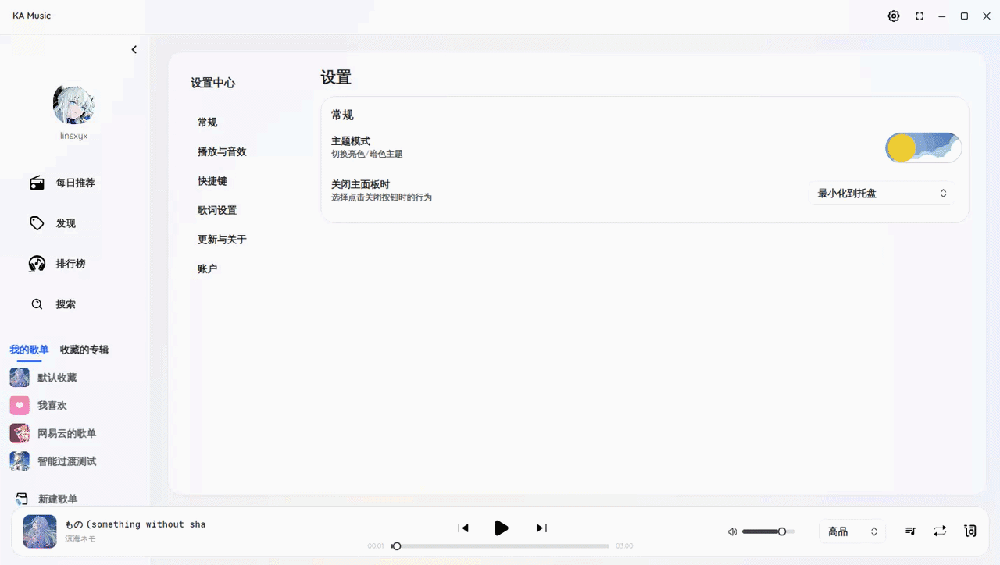

<div align="center">
  

  <h1>KA Music</h1>


  <p>
    <a href="https://dotnet.microsoft.com"></a>
    <a href="LICENSE"></a>
    <a href="https://github.com/Linsxyx/KugouMusic.NET/releases"></a>
    <a href="https://github.com/Linsxyx/KugouMusic.NET/releases"></a>
    <a href="https://github.com/Linsxyx/KugouMusic.NET/releases"></a>
  </p>

  <p>
    <a href="https://github.com/Linsxyx/KugouMusic.NET/releases">下载体验</a>
    ·
    <a href="https://github.com/Linsxyx/KugouMusic.NET/issues">问题反馈</a>
    ·
    <a href="#页面展示">查看截图</a>
  </p>
</div>

最好用、最轻量的酷狗音乐概念版播放器，登录自动领取 VIP。

项目基于 **.NET 10 + Avalonia** 打造，尽量提供一致的全平台桌面体验，而不是浏览器套壳式客户端。因为作者长期使用 Arch Linux 和 Windows 双系统，而 Linux 上又缺少一款体验完整的酷狗音乐播放器，这个项目就这样诞生了。

> 注：“最好用、最轻量”是项目目标与设计方向。

## 快速开始

- 下载地址：[Releases](https://github.com/Linsxyx/KugouMusic.NET/releases)
- 问题反馈：[Issues](https://github.com/Linsxyx/KugouMusic.NET/issues)
- 桌面客户端：`KugouAvaloniaPlayer`
- 终端播放器：`KgTest`
- 开发者入口：`KuGou.Net` / `KgWebApi.Net` / `SimpleAudio`

## 为什么值得用

- 更轻：基于 Avalonia 原生桌面栈，不走 Electron 路线，安装包体积小
- 更像桌面播放器：托盘、桌面歌词、关闭行为、自动更新这些桌面交互是完整的
- 对 Linux 更友好，在Linux也能拥有和其他平台一样的托盘和歌词悬浮窗体验
- 酷狗生态能力完整：登录、推荐、榜单、歌单、搜索、歌词、VIP 状态都已接入
- 在线和本地都能打：支持在线播放，也支持本地文件夹导入、本地歌词和本地播放
- 搬家无压力：支持解析并导入网易云音乐、QQ 音乐歌单，轻松迁移歌单
- 播放控制更到位：播放队列、随机模式、热切音质、10 段均衡器都可用
- 智能过渡：在PC端也能体验到丝滑的智能过渡效果（点名批评网易云PC版甚至没这功能）

## 页面展示

### 主界面

每日推荐、歌单推荐、排行榜、搜索歌曲。


### 搜索

搜索歌曲、歌单、专辑。



### 桌面歌词

Apple Music风味的滚动歌词，支持在线歌词和本地歌词，歌词浮窗全平台体验一致。



### 设置与播放体验

播放器设置、音效与常用行为都有独立入口。



## 下载与平台支持

请前往 [Releases](https://github.com/Linsxyx/KugouMusic.NET/releases) 下载最新版本。

- Windows x64：`KugouAvaloniaPlayer-win-x64.exe`
- Linux x64：`KugouAvaloniaPlayer-linux-x64.AppImage`
- Linux arm64（手动更新包）：`KugouAvaloniaPlayer-linux-arm64.tar.gz`
- macOS arm64 安装包：`KugouAvaloniaPlayer-mac-arm64-Setup.pkg`
- macOS arm64（手动更新包）：`KugouAvaloniaPlayer-mac-arm64.app.zip`
- macOS x64（手动更新包）：`KugouAvaloniaPlayer-mac-x64.app.zip`

### 自动更新

项目通过 **Velopack + GitHub Releases** 提供更新能力。

- 支持自动更新的架构：
  - Windows x64（`KugouAvaloniaPlayer-win-x64.exe`）
  - Linux x64（`KugouAvaloniaPlayer-linux-x64.AppImage`）
  - macOS arm64（`KugouAvaloniaPlayer-mac-arm64-Setup.pkg`）
- 不支持自动更新的架构（仅手动更新）：
  - Linux arm64（`KugouAvaloniaPlayer-linux-arm64.tar.gz`）
  - macOS x64（`KugouAvaloniaPlayer-mac-x64.app.zip`）
- 手动更新方式：
  - 下载对应架构的新压缩包
  - 解压后覆盖旧程序目录，或迁移到新目录运行
  - 手动更新不会自动提示，请定期关注 Releases

### macOS 说明

当前 macOS 安装包未签名，如遇到 Gatekeeper 拦截，可执行：

```bash
xattr -dr com.apple.quarantine /Applications/KugouAvaloniaPlayer.app
```

如果 `KugouAvaloniaPlayer-mac-arm64-Setup.pkg` 无法安装，可以改用 `KugouAvaloniaPlayer-mac-arm64.app.zip` 解压运行；`KugouAvaloniaPlayer-mac-x64.app.zip` 本身就是手动更新包，不支持自动更新。

## 核心功能

### 在线内容

- 手机号验证码登录
- 二维码扫码登录
- 登录持久化与自动恢复
- 每日推荐
- 发现歌单与推荐内容
- 排行榜与榜单歌曲分页
- 歌手详情页
- 搜索歌曲、歌单、专辑
- 用户信息与 VIP 状态展示

### 本地播放

- 导入本地音乐文件夹并播放
- 未登录可播放本地歌曲
- 支持本地 KRC / LRC / VTT 歌词
- 在线歌词与本地歌词协同工作

### 桌面体验

- 桌面歌词浮窗
- 歌词逐字高亮与进度动画
- 系统托盘菜单
- 关闭行为可配置：退出程序 / 最小化到托盘
- 自动更新

### 播放控制与音质

- 在线歌曲播放
- 播放队列管理
- 下一首播放 / 随机模式
- 热切播放音质
- 10 段均衡器，支持预设与自定义
- 收藏当前歌曲、在线歌单增删改

### 跨平台支持

- Windows、Linux、macOS 三端可运行
- Linux 提供 `AppImage`
- 桌面歌词鼠标穿透支持跨平台实现

## 为什么它在 Linux 上更值得用

很多音乐播放器对于Linux的支持很差，无法拥有和其他平台一样的体验。`KA Music` 的目标不是停留在能运行，而是尽量把 Linux 桌面用户真正会在意的体验补齐，托盘、桌面歌词、本地播放、基础设置和日常交互都要可用，歌词悬浮窗能像Windows平台一样鼠标穿透、置顶、透明。

## 常见问题

### 1. 为什么我本地运行时提示无法自动更新？

自动更新依赖 Velopack 安装。若你通过 `dotnet run` 或手动复制文件运行，应用会跳过自动更新检查。请使用 Releases 安装包安装。

### 2. 为什么未登录时不能播放在线歌曲？

当前在线播放要求有效登录态。你可以先登录，也可以直接播放本地导入的歌曲。

### 3. 为什么应用显示名是 KA Music，但安装包名还是 KugouAvaloniaPlayer？

这是为了兼容历史版本升级链路。应用显示名可以继续优化，但安装包标识保持稳定，能避免老版本升级断链。

### 4. 支持哪些歌词格式？

当前支持在线 KRC，以及本地 `KRC`、`LRC`、`VTT` 歌词。


## 开发者入口

这个仓库不只有播放器本体，也包含围绕酷狗能力做的几个底层项目。

- `KugouAvaloniaPlayer`：Avalonia 桌面客户端，也就是现在的 `KA Music`
- `KgTest`：终端 TUI 播放器
- `KuGou.Net`：酷狗业务 SDK，封装登录、搜索、歌单、歌词、榜单、用户等能力
- `KgWebApi.Net`：基于 SDK 的 ASP.NET Core Web API 封装
- `SimpleAudio`：基于 ManagedBass 的跨平台播放与音效层
- `KuGou.Net.Native`：把 SDK 能力导出为 Native AOT 友好的 C ABI

## 终端播放器 KgTest

`KgTest` 一个测试用的终端播放器，功能还算凑合，目前也把智能过渡功能加上了，想试试的可以克隆仓库运行。详细功能、快捷键和配置说明见 [KgTest/README.md](KgTest/README.md)。

### 本地开发

```bash
git clone https://github.com/Linsxyx/KugouMusic.NET.git
cd KugouMusic.NET

dotnet restore KugouMusic.NET.slnx
dotnet build KugouMusic.NET.slnx

dotnet run --project KugouAvaloniaPlayer/KugouAvaloniaPlayer.csproj
```

如需运行终端播放器：

```bash
dotnet run --project KgTest/KgTest.csproj
```

如需运行 Web API：

```bash
dotnet run --project KgWebApi.Net/KgWebApi.Net.csproj
```

Web API 文档（开发环境）：`http://localhost:5058/scalar/v1`

## 仓库结构

```text
KugouMusic.NET
├─ KugouAvaloniaPlayer   # Avalonia 桌面客户端
├─ KgTest                # 终端 TUI 播放器
├─ KuGou.Net             # 核心 SDK
├─ SimpleAudio           # 音频播放与音效层
├─ KgWebApi.Net          # ASP.NET Core Web API
├─ KuGou.Net.Native      # Native AOT 导出层
└─ docs/images           # README 截图资源
```

## 计划更新

下一次更新计划：

- 优化滚动歌词动效和错峰延迟
- 升级到 Avalonia 12

## 更新日志

完整版本历史请查看 [Releases](https://github.com/Linsxyx/KugouMusic.NET/releases)。

### v1.3.1
- 桌面歌词支持双行显示
- 优化设置中的“更新与关于”页面
- 可编辑本地歌单名称和封面、可编辑本地歌曲封面

### v1.3.0（已删除）
> 该版本因 AOT 发布后存在更新检查闪退问题，已从 Releases 删除，请不要安装或更新到此版本。

- ~~可切换桌面歌词是否显示翻译，可在桌面歌词开启随机播放~~
- ~~优化滚动歌词~~
- ~~优化音频可视化~~

### v1.2.0
- 更好的智能过渡
- 支持专辑的收藏


## 👍 灵感来源

- [KuGouMusicApi](https://github.com/MakcRe/KuGouMusicApi)

## ⚠️ 免责声明

本项目是基于公开 API 接口开发的第三方音乐客户端，仅供个人学习和技术研究使用。
- **数据来源**：所有音乐数据通过公开接口获取，本项目不存储、不传播任何音频文件
- **版权声明**：音乐内容版权归原平台及版权方所有，请尊重知识产权，支持正版音乐
- **使用限制**：禁止将本项目用于任何商业用途或违法行为
- **责任声明**：因使用本项目产生的任何法律纠纷或损失，均由使用者自行承担
- **争议处理**：如果官方音乐平台觉得本项目不妥，请通过 Issues 联系
