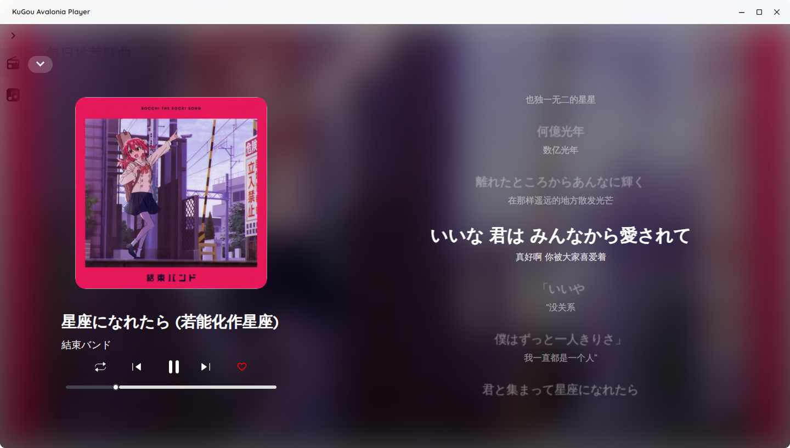
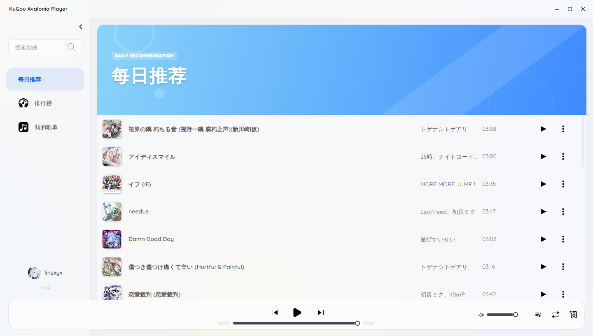
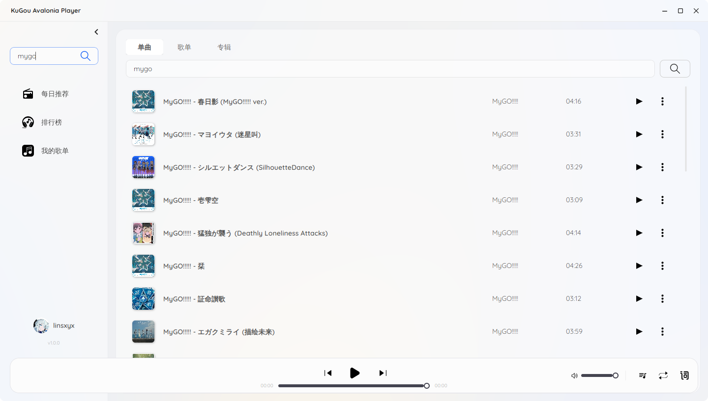
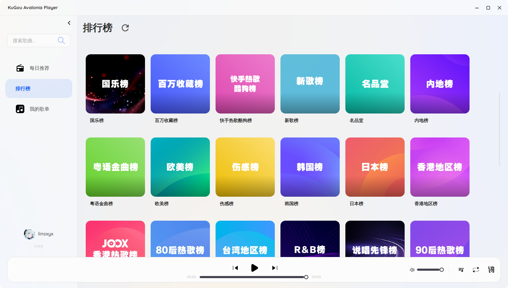

# KugouMusic.NET

[](https://dotnet.microsoft.com)
[](LICENSE)
[](https://github.com/Linsxyx/KugouMusic.NET/releases)

基于 **.NET 10.0 + Avalonia** 开发的**跨平台酷狗音乐桌面客户端**。

---

## ✨ 特性

- 🎵 完整集成酷狗音乐 API（搜索、歌单、每日推荐、歌手页、滚动歌词）
- 🔄 **在线自动更新**
- 🖥️ 真正跨平台（Windows / Linux / macOS）
- 🎨 现代 Avalonia UI + MVVM

---

## 📸 截图





---

## 🚀 下载与安装

### 推荐方式
访问 [Releases](https://github.com/Linsxyx/KugouMusic.NET/releases) 页面下载：

- **Windows**：`KugouAvaloniaPlayer-win.exe`
- **Linux**：`KugouAvaloniaPlayer-linux.AppImage`
- **Mac**：`KugouAvaloniaPlayer-mac.pkg`

安装后**每次启动程序会自动检查更新**，发现新版本会提示一键更新，可设置是否自动更新。

---

## 🛠️ 本地构建（开发者）

```bash
# 1. 克隆
git clone https://github.com/Linsxyx/KugouMusic.NET.git
cd KugouMusic.NET

# 2. 还原 & 构建
dotnet restore KugouMusic.NET.slnx
dotnet build KugouMusic.NET.slnx

# 3. 运行桌面客户端
dotnet run --project KugouAvaloniaPlayer/KugouAvaloniaPlayer.csproj

# 4. 调试酷狗API
dotnet run --project KgWebApi.Net/KgWebApi.Net.csproj
# 访问http://localhost:5058/scalar/v1
```